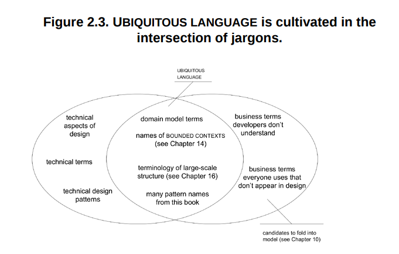
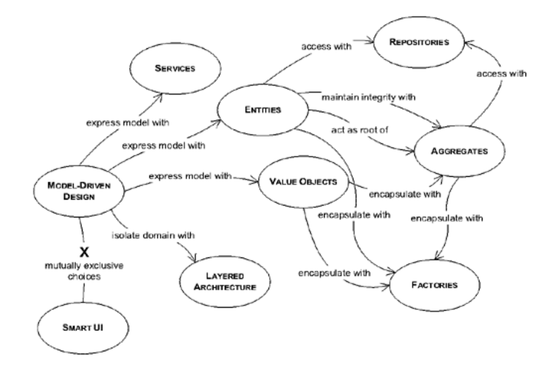
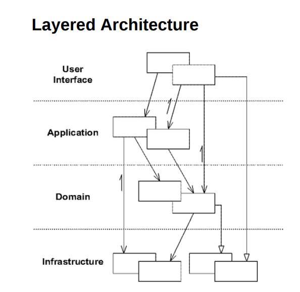
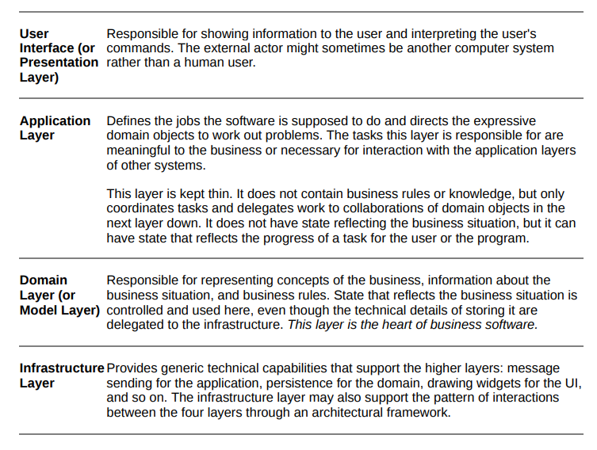

# DDD - Domain Driven Design
##### tackling complexity in the heart of software

By Eric evans and introdutions of Martin Fowler.

## Part 1: Putting the Domain Model to Work

-  A model is a simplification of reality. It is an interpretation of reality that abstracts the aspects relevant to solving the problem at hand and ignores extraneous detail.

### One. Crunching Knowledge

- Build a diagram, with any annotation or any, just have something em common with the expertise of domain. You have to communicate what have you understand about the domain so he can give you feedback about it.

- When we have an unimportant model and an important have an interaction we should build a new model a different one from the other ones Eric called this as *Distilling the model*, given a example :
    - Model A is relevant and model B is not. We have a new use case where we should use model B with A. So this new use case is a new model, therefore we should make a modelAB or modelC to make clear the relevance of model A stay relevant e not "contaminated" with the irrelevance of B.

- Build a model -> test -> feedback -> repeat (massive experimentation)

### Two. Communication and the Use of Language

- Ubiquitous Language! A project where we don't have the Ubiquitous Language present the developers have to translate what the specialist of domain are saying to others developers, the developers have to translate what they have into domain today to the specialists, all this translation only make miss understanding of what the domain should be, all this translation makes the team run slower and build a poor domain.

- Ubiquitous Language forces the weaknesses of domain out, makes the team communicate in one language and ensure with the language changes the code will too.

- The preparation to new models or refine the domain you must Modeling Out Loud! Explore with speech. Trying out loud various constructs from possible model variations. It's easy to hear what is wrong.

- Documents and diagrams should be used to explain the main frame of domain and none functional requirements of a system. They should short, clear and concise.

- The fundamental details about the domain are in the code!

- Document everything? Or Anything? A document should not do what a code do well. The code give us all details about the system. Therefore, use diagrams to get the big picture of the system.

- It takes <strong>fastidiousness</strong> to write code that doesn't just do the right thing but also says the right thing.

### Three. Binding Model and Implementation

- You software should have concept, ideals, things to be respected by the design and de developers.

- Modeling and designing should be a one thing, when a model it doesn't seem practical to the implementation we should build a new one, when a model doesn't show all fundamentals concepts about the domain we should build a new one.

- Pages 48 until 53 has a good example of modeling or a new business use case should be made as model driven design. 

- A model driven design demands we work only with him. (Read the example in page 53)

- You should have your specialist/architect/Modelers developing the code together with the tech team. Software development is a coupled activity with the architecting, you only know with your plans and draws are right when you have your hands on the code.

## Part 2: The Building Blocks of a Model-Driven Design

### Four. Isolating the Domain

- A software can handle the execution of complex things demands the separation of the things, allowing complicated interactions and isolating implementations.

- Layered architecture is a well know pattern and should be understood by every developer.

- The essential principle:
    - Any element of a layer depends only on other elements in the same layer or on elements of the layers "beneath" it.
    - Communication upward must pass through some indirect mechanism. (interfaces, dependency injection, Observer pattern)

- Architectural Structure should help the domain developers to focus on develop the complexity of the domain and not carrying to satisfy the limits of software. I know this phrase sounds a utopia but i like to think that we should always have this purpose, the rules of your architecture should not be a problem, should help, should potentialize the domain developers, they should be modeling the core business problems and not Architectural structures.

- <strong>The Smart UI "Anti-Pattern"</strong>: pages 73 and 74 pros and cons.
    - <strong>TLDR:</strong> You only should use this pattern to learn something from your user, as pretty fast MVP. Have you learned what you wanted? Yes, take this software to the trash and build a real API and real Frontend. No? Do the same.

