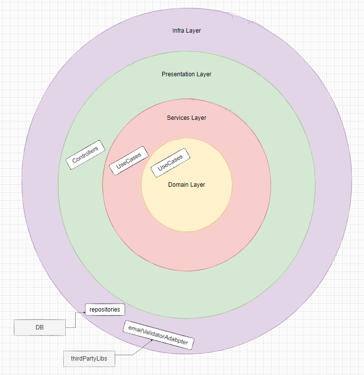
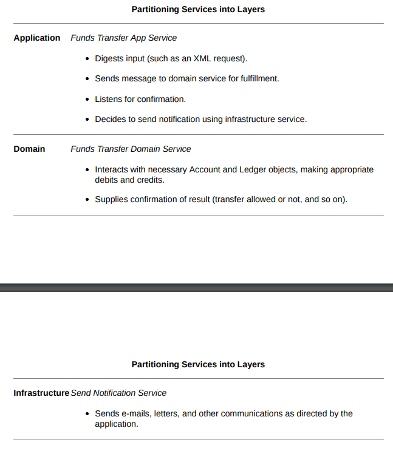
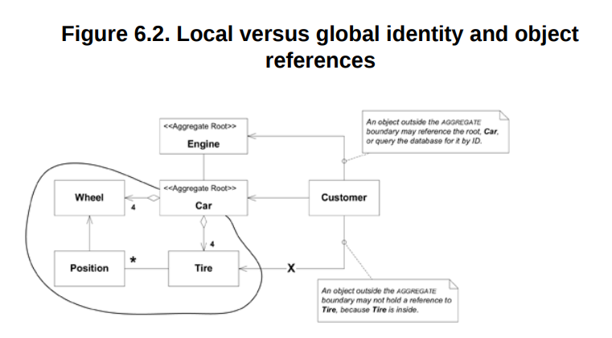

# DDD - Domain Driven Design
##### tackling complexity in the heart of software

By Eric evans and introdutions of Martin Fowler.

## Part 1: Putting the Domain Model to Work

-  A model is a simplification of reality. It is an interpretation of reality that abstracts the aspects relevant to solving the problem at hand and ignores extraneous detail.

### One. Crunching Knowledge

- Build a diagram, with any annotation or any, just have something em common with the expertise of domain. You have to communicate what have you understand about the domain so he can give you feedback about it.

- When we have an unimportant model and an important have an interaction we should build a new model a different one from the other ones Eric called this as *Distilling the model*, given a example :
    - Model A is relevant and model B is not. We have a new use case where we should use model B with A. So this new use case is a new model, therefore we should make a modelAB or modelC to make clear the relevance of model A stay relevant e not "contaminated" with the irrelevance of B.

- Build a model -> test -> feedback -> repeat (massive experimentation)

### Two. Communication and the Use of Language

- Ubiquitous Language! A project where we don't have the Ubiquitous Language present the developers have to translate what the specialist of domain are saying to others developers, the developers have to translate what they have into domain today to the specialists, all this translation only make miss understanding of what the domain should be, all this translation makes the team run slower and build a poor domain.

- Ubiquitous Language forces the weaknesses of domain out, makes the team communicate in one language and ensure with the language changes the code will too.

- The preparation to new models or refine the domain you must Modeling Out Loud! Explore with speech. Trying out loud various constructs from possible model variations. It's easy to hear what is wrong.


- Documents and diagrams should be used to explain the main frame of domain and none functional requirements of a system. They should short, clear and concise.

- The fundamental details about the domain are in the code!

- Document everything? Or Anything? A document should not do what a code do well. The code give us all details about the system. Therefore, use diagrams to get the big picture of the system.

- It takes <strong>fastidiousness</strong> to write code that doesn't just do the right thing but also says the right thing.

### Three. Binding Model and Implementation

- You software should have concept, ideals, things to be respected by the design and de developers.

- Modeling and designing should be a one thing, when a model it doesn't seem practical to the implementation we should build a new one, when a model doesn't show all fundamentals concepts about the domain we should build a new one.

- Pages 48 until 53 has a good example of modeling or a new business use case should be made as model driven design. 

- A model driven design demands we work only with him. (Read the example in page 53)

- You should have your specialist/architect/Modelers developing the code together with the tech team. Software development is a coupled activity with the architecting, you only know with your plans and draws are right when you have your hands on the code.

## Part 2: The Building Blocks of a Model-Driven Design


### Four. Isolating the Domain

- A software can handle the execution of complex things demands the separation of the things, allowing complicated interactions and isolating implementations.


- Layered architecture is a well know pattern and should be understood by every developer.

- The essential principle:
    - Any element of a layer depends only on other elements in the same layer or on elements of the layers "beneath" it.
    - Communication upward must pass through some indirect mechanism. (interfaces, dependency injection, Observer pattern)




- Architectural Structure should help the domain developers to focus on develop the complexity of the domain and not carrying to satisfy the limits of software. I know this phrase sounds a utopia but i like to think that we should always have this purpose, the rules of your architecture should not be a problem, should help, should potentialize the domain developers, they should be modeling the core business problems and not Architectural structures.

- <strong>The Smart UI "Anti-Pattern"</strong>: pages 73 and 74 pros and cons.
    - <strong>TLDR:</strong> You only should use this pattern to learn something from your user, as pretty fast MVP. Have you learned what you wanted? Yes, take this software to the trash and build a real API and real Frontend. No? Do the same.

### Five. A Model Expressed in Software

- Sometimes are models or aspects of your domain that you should express then as action, operation as a service. Then try to express the same thing as an entity or in a value object.

- For each association (many to many) it's possible to have a bidirectional communication, so if you have this association this models only makes sense when they are together.

- You avoid many-to-many associations because this kind are the most difficult ones to maintain and also says very little about the domain. To make this happen, we have 3 rules to help to distilling our domain
    1. Imposing a traversal direction
    2. Adding a qualifier, effectively reducing multiplicity
    3. Eliminating nonessential associations

- Imposing a traversal direction in association many to many reduce the implementation to one to many and this association it's much better to maintain and express a lot more than many-to-many. You should express by your speech about the domain. A financial responsible has many children/students and a children can have many financial responsible, so we could model this association as many to many. What if we impose a direction given a restriction to this association, attention this imposing only makes sense if your domain allows this restriction, our restriction it will be a children/students only can have one responsible and this association is one to many, one responsible can have many children/students. Again, this restriction only makes sense if your domain expertise says and agree with or this association to many-to-many is not important.

- When a bidirectional association is semantic with the domain, when it's necessary for the functionality of the system, so therefore this association will make sense and express this by domain.

- <strong>Defining entities</strong>
    - First: we should not model an entity by his attributes, but do by his meaning and conceptual identity.
    - The fundamental conceptual about entity is abstract meaning and can change forms but still the same entity.
    - A entity should define his classes/structs, responsibilities, attributes and associations by what this entity is by his meaning to the domain.
    - Focus to maintain an entity by his identity in the domain and his life cycle. This identification to make an entity unique/with identity can come from the domain and also from the system.
    - Only entities can have unique identifiers (IDs)

- Page 88 and 89 example about entity.

- <strong>Defining value objects</strong>
    - Value objects make part of the domain as entities.
    - Value objects represent a descriptive aspect of our domain. They don't have a unique identifier, and we should only care about what they are.
        - `represents a descritive aspect of our domain` the meaning about this is that you are going to have your entities objects with IDs, business responsibilities and the Value objects will represent an object that is not stored in the DB but, has some methods and functions will help you to describe better the domain.
    - They are usually passed by parameters to execute a method and discarded, for example:
        
        ````go 
        type Customer struct {
            ID        uuid.UUID
            Name      string
            LegalForm LegalForm
            Date      time.Time
        }

        type Person struct {
            FullName string
            Birthday Birthday
        }

        type Company struct {
            Name         string
            CreationDate time.Time
        }

        func (c Customer) ToPerson() Person {
            return Person{
                FullName: c.Name,
                Birthday: c.Date,
            }
        }

        func (c Customer) ToCompany() Company {
            return Company{
                Name: c.Name,
                CreationDate: c.Date,
            }
        }

        ````
    - Here we have Customer as an entity and Person and Company as value objects helping us to describe our domain. Person and Company could have any methods and any rules from his specification of his orders or others entities from the system, here we only made a parse from entity to value object.

- <strong>Defining services</strong>
    - Services are actions, operations, intentions and not something.
    - Services don't store state.
    - Usually they are named as verbs and not nouns as entities and value objects.
    - Services can be used as infrastructure services, application services and the domain services.
    

- <strong>Defining Modules</strong>
    - Modules are packages responsible to define epics from the domain, they should tell us a story 
    - They should have Low coupling and high cohesion are general design principles, and they also are deployable units.
    - Unless there is a real intention to distribute code on different
    servers, keep all the code that implements a single conceptual
    object in the same MODULE.

For example:

````
    project
    |--...
    |--pkg
    |--access
        |--infrastructure
            |--repositories
        |--presentation
            |--...
        |--application
            |--service
                |--authorization.go
                |--registration.go
        |--domain     
            |--model
                |--user.go
                |--group.go
                |--role.go
        |--access.go
    |--shopping
        |--infrastructure
            |--repositories
        |--presentation
            |--...
        |--application
            |--service
                |--session_basket.go
        |--domain     
            |--service 
                |--shopping.go 
            |--factory 
                |--basket.go  
            |--model
                |--order.go
                |--basket.go
        |--shopping.go
    |--customer
        |--infrastructure
            |--repositories
        |--presentation
            |--...
        |--application
            |--...
        |--domain  
            |--model
                |--customer.go 
                |--address.go 
        |--customer.go
    |--...
    |--...
````
- Here we have 3 modules Customer, Shopping and Access.

### Six. The Life Cycle of a Domain Object

- Aggregates
    - Is an abstraction that will delimit an area of association between one or more objects of a domain. This area helps to determinate who can access this objects, who is the root of the aggregation and how the updates will work in the associations.
    - In other words, will be a group of objects associated that we will treat as unit to update data.
    - Aggregates has a Root and a limit, everything inside limit is inside of aggregate and the Root is unique in the aggregate and other objects outside of limits can access by the root the object's aggregated

    - Page 122 has all detailed rules about aggregates.

- Factories
    - Factories are creational project pattern, they know how to build your objects and his responsibility is to encapsulate all complexity of how to create your domain objects, services and etc...
    - Build an interface and make sure the client will never make reference to the concrete classes responsible to build the objects.
    - Take care about arguments, factories are tied coupled into his arguments if your arguments are complex your factory will be too, keep simple and small.
    - If factory is building a domain object and this object is inside of Aggregation, it is the responsibility of factory to always build a valid aggregate.

- Repositories
    - TL DR: Responsable to encapsulate all code necessary to access a database adn execute querys.

### Seven. Using the Language: An Extended Example
- I strong recommend you to read chapter seven!! Here Eric is going to get everything he has already explained and will use a real example it's very important chapter here you will see the difference between you and Eric building the same system and see how different will become his from yours ideas. This doesn't mean that Eric it corrects, it's just very interesting.
- Pages 155.
- TODO: Build a system with the same design and funcionalities and link the repo here


## Part 3: Refactoring Toward Deeper Insight

