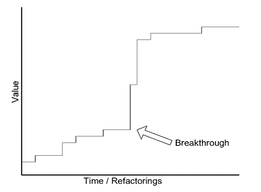

# DDD - Domain Driven Design
##### tackling complexity in the heart of software

By Eric evans and introdutions of Martin Fowler.

## Part 1: Putting the Domain Model to Work

-  A model is a simplification of reality. It is an interpretation of reality that abstracts the aspects relevant to solving the problem at hand and ignores extraneous detail.

### One. Crunching Knowledge

- Build a diagram, with any annotation or any, just have something em common with the expertise of domain. You have to communicate what have you understand about the domain so he can give you feedback about it.

- When we have an unimportant model and an important have an interaction we should build a new model a different one from the other ones Eric called this as *Distilling the model*, given a example :
    - Model A is relevant and model B is not. We have a new use case where we should use model B with A. So this new use case is a new model, therefore we should make a modelAB or modelC to make clear the relevance of model A stay relevant e not "contaminated" with the irrelevance of B.

- Build a model -> test -> feedback -> repeat (massive experimentation)

### Two. Communication and the Use of Language

- Ubiquitous Language! A project where we don't have the Ubiquitous Language present the developers have to translate what the specialist of domain are saying to others developers, the developers have to translate what they have into domain today to the specialists, all this translation only make miss understanding of what the domain should be, all this translation makes the team run slower and build a poor domain.

- Ubiquitous Language forces the weaknesses of domain out, makes the team communicate in one language and ensure with the language changes the code will too.

- The preparation to new models or refine the domain you must Modeling Out Loud! Explore with speech. Trying out loud various constructs from possible model variations. It's easy to hear what is wrong.


- Documents and diagrams should be used to explain the main frame of domain and none functional requirements of a system. They should short, clear and concise.

- The fundamental details about the domain are in the code!

- Document everything? Or Anything? A document should not do what a code do well. The code give us all details about the system. Therefore, use diagrams to get the big picture of the system.

- It takes <strong>fastidiousness</strong> to write code that doesn't just do the right thing but also says the right thing.

### Three. Binding Model and Implementation

- You software should have concept, ideals, things to be respected by the design and the developers.

- Modeling and designing should be a one thing, when a model it doesn't seem practical to the implementation we should build a new one, when a model doesn't show all fundamentals concepts about the domain we should build a new one.

- Pages 48 until 53 has a good example of modeling or a new business use case should be made as model driven design. 

- A model driven design demands we work only with him. (Read the example in page 53)

- You should have your specialist/architect/Modelers developing the code together with the tech team. Software development is a coupled activity with the architecting, you only know with your plans and draws are right when you have your hands on the code.

## Part 2: The Building Blocks of a Model-Driven Design


### Four. Isolating the Domain

- A software can handle the execution of complex things demands the separation of the things, allowing complicated interactions and isolating implementations.


- The essential principle:
    - Any element of a layer depends only on other elements in the same layer or on elements of the layers "beneath" it.
    - Communication upward must pass through some indirect mechanism. (interfaces, dependency injection, Observer pattern)


- Architectural Structure should help the domain developers to focus on develop the complexity of the domain and not carrying to satisfy the limits of software. I know this phrase sounds a utopia but i like to think that we should always have this purpose, the rules of your architecture should not be a problem, should help, should potentialize the domain developers, they should be modeling the core business problems and not Architectural structures.

- <strong>The Smart UI "Anti-Pattern"</strong>: pages 73 and 74 pros and cons.
    - <strong>TLDR:</strong> You only should use this pattern to learn something from your user, as pretty fast MVP. Have you learned what you wanted? Yes, take this software to the trash and build a real API and real Frontend. No? Do the same.

### Five. A Model Expressed in Software

- Sometimes are models or aspects of your domain that you should express then as action, operation as a service. Then try to express the same thing as an entity or in a value object.

- For each association (many to many) it's possible to have a bidirectional communication, so if you have this association this models only makes sense when they are together.

- You avoid many-to-many associations because this kind are the most difficult ones to maintain and also says very little about the domain. To make this happen, we have 3 rules to help to distilling our domain
    1. Imposing a traversal direction
    2. Adding a qualifier, effectively reducing multiplicity
    3. Eliminating nonessential associations

- Imposing a traversal direction in association many to many reduce the implementation to one to many and this association it's much better to maintain and express a lot more than many-to-many. You should express by your speech about the domain. A financial responsible has many children/students and a children can have many financial responsible, so we could model this association as many to many. What if we impose a direction given a restriction to this association, attention this imposing only makes sense if your domain allows this restriction, our restriction it will be a children/students only can have one responsible and this association is one to many, one responsible can have many children/students. Again, this restriction only makes sense if your domain expertise says and agree with or this association to many-to-many is not important.

- When a bidirectional association is semantic with the domain, when it's necessary for the functionality of the system, so therefore this association will make sense and express this by domain.

- <strong>Defining entities</strong>
    - First: we should not model an entity by his attributes, but do by his meaning and conceptual identity.
    - The fundamental conceptual about entity is abstract meaning and can change forms but still the same entity.
    - A entity should define his classes/structs, responsibilities, attributes and associations by what this entity is by his meaning to the domain.
    - Focus to maintain an entity by his identity in the domain and his life cycle. This identification to make an entity unique/with identity can come from the domain and also from the system.
    - Only entities can have unique identifiers (IDs)

- Page 88 and 89 example about entity.

- <strong>Defining value objects</strong>
    - Value objects make part of the domain as entities.
    - Value objects represent a descriptive aspect of our domain. They don't have a unique identifier, and we should only care about what they are.
        - `represents a descritive aspect of our domain` the meaning about this is that you are going to have your entities objects with IDs, business responsibilities and the Value objects will represent an object that is not stored in the DB but, has some methods and functions will help you to describe better the domain.
    - When you only care about the properties of a model name this model as value-object, ensure he will express well the meaning of all properties he has and give him a functionality related.
    - Treat value objects as immutable, there is no update, only delete and create a new one. 
    - They are usually passed by parameters to execute a method and discarded, for example:
        ````go 
        type Customer struct {
            ID        uuid.UUID
            Name      string
            LegalForm LegalForm
            Date      time.Time
        }

        type Person struct {
            FullName string
            Birthday Birthday
        }

        type Company struct {
            Name         string
            CreationDate time.Time
        }

        func (c Customer) ToPerson() Person {
            return Person{
                FullName: c.Name,
                Birthday: c.Date,
            }
        }

        func (c Customer) ToCompany() Company {
            return Company{
                Name: c.Name,
                CreationDate: c.Date,
            }
        }

        ````
    - Here we have Customer as an entity and Person and Company as value objects helping us to describe our domain. Person and Company could have any methods and any rules from his specification of his orders or others entities from the system, here we only made a parse from entity to value object.

- <strong>Defining services</strong>
    - Services are actions, operations, intentions and not something.
    - Services don't store state.
    - Usually they are named as verbs and not nouns as entities and value objects.
    - Services can be used as infrastructure services, application services and the domain services.
    

- <strong>Defining Modules</strong>
    - Modules are packages responsible to define epics from the domain, they should tell us a story 
    - They should have Low coupling and high cohesion are general design principles, and they also are deployable units.
    - Unless there is a real intention to distribute code on different
    servers, keep all the code that implements a single conceptual
    object in the same MODULE.

For example:

````
    project
    |--...
    |--pkg
    |--access
        |--infrastructure
            |--repositories
        |--presentation
            |--...
        |--application
            |--service
                |--authorization.go
                |--registration.go
        |--domain     
            |--model
                |--user.go
                |--group.go
                |--role.go
        |--access.go
    |--shopping
        |--infrastructure
            |--repositories
        |--presentation
            |--...
        |--application
            |--service
                |--session_basket.go
        |--domain     
            |--service 
                |--shopping.go 
            |--factory 
                |--basket.go  
            |--model
                |--order.go
                |--basket.go
        |--shopping.go
    |--customer
        |--infrastructure
            |--repositories
        |--presentation
            |--...
        |--application
            |--...
        |--domain  
            |--model
                |--customer.go 
                |--address.go 
        |--customer.go
    |--...
    |--...
````
- Here we have 3 modules Customer, Shopping and Access.
- If some modules have some kind of dependency, we should implement an object responsible to map a structure from one module to another one. We are going to see more about this further in this paper.

### Six. The Life Cycle of a Domain Object

- <strong>Aggregates</strong>
    - Is an abstraction that will delimit an area of association between one or more objects of a domain. This area helps to determinate who can access this objects, who is the root of the aggregation and how the updates will work in the associations.
    - In other words, will be a group of objects associated that we will treat as unit to update and select data.
    - Aggregates has a Root and a limit, everything inside limit is inside of aggregate and the Root is unique in the aggregate and other objects outside of limits can access by the root the object's aggregated.
    - This is another tool to help us to modelling our domain, everything inside an aggregation should make sense with the domain.
    - Aggregates are just a group of entities and value objects where make sense with the domain.
    - The main idea and concepts about the aggregates are here but with you want to implement a one, you should know all detailed rules about it what you can do, should and not do with aggregates. These rules are in the page 121 until 123.
Example:


- <strong>Factories</strong>
    - Factories are creational project pattern, they know how to build your objects and his responsibility is to encapsulate all complexity of how to create your domain objects, services and etc...
    - Build an interface and make sure the client will never make reference to the concrete classes responsible to build the objects.
    - Take care about arguments, factories are tied coupled into his arguments if your arguments are complex your factory will be too, keep simple and small.
    - If factory is building a domain object and this object is inside of Aggregation, it is the responsibility of factory to always build a valid aggregate.

- <strong>Repositories</strong>
    - TL DR: Responsable to encapsulate all code necessary to access a database adn execute querys.

### Seven. Using the Language: An Extended Example
- <strong>I strong recommend you to read chapter seven!!</strong> Here Eric is going to get everything he has already explained and will use a real example it's very important chapter here you will see the difference between you and Eric building the same system and see how different will become his from yours ideas. This doesn't mean that Eric it corrects, there is no correct here, it's just very interesting and different.
- Pages 155.
- TODO: Build a system with the same design and funcionalities and link the repo here

## Part 3: Refactoring Toward Deeper Insight

- The real challenge is to actually find an incisive model, one that captures subtle concerns of the domain experts and can drive a practical design. Ultimately, we hope to develop a model that captures a deep understanding of the domain. This should make the software more in tune with the way the domain experts think and more responsive to the
user's needs.

- Success developing useful models comes down to three points.
    1. Sophisticated domain models are achievable and worth the trouble.
    2. They are seldom developed except through an iterative process of refactoring,including close involvement of the domain experts with developers interested in learning about the domain.
    3. They may call for sophisticated design skills to implement and to use effectively.

### Eight. Breakthrough

- The returns from refactoring are not linear. Usually there is a marginal return for a small effort, and the small improvements add up. They fight entropy, and they are the frontline protection against a fossilized legacy. But some of the most important insights come abruptly and send a shock through the project.



- When an opportunity of breakthrough show up in a project usually they are terrifying, this kind of refactoring shows bigger risks than the usually refactorings in the project.

- Here Eric is going to tell a history from hiss carrier and give good examples of refactoring, if you are interested to go a deeper LVL into design and new models follow this chapter a head.

### Nine. Making Implicit Concepts Explicit

- Many transformations of domain models and the corresponding code happen when developers recognize a concept that has been hinted at in discussion or present implicitly in the design, and they then represent it explicitly in the model with one or more objects or relationships.

- All start with the recognization of the implicit concepts.

- Listen to the language the domain experts use. Are there terms that succinctly state something complicated? Are they correcting your word choice (perhaps diplomatically)? Do the puzzled looks on their faces go away when you use a particular phrase? These are hints of a concept that might benefit the model. (UBIQUITOUS LANGUAGE)

- Pages 199 until 208 good example of `Making Implicit Concepts Explicit`.

- If something sounds bad or smells bad. Take a look! Probably you don't know something about the domain or your design is not good enough

### Ten. Supple Design

- The ultimate purpose of software is to serve users. But first, that same software ha to serve developers.

- Here Eric will list to us a lot of tools for a good design starting with `Intention revealing interfaces`, he will give to us small example in the page 237 and this example will grow with all other tools until page 253, so I strong recommend reading all the examples.

- <strong>Intention revealing interfaces</strong>
    -  We are always fighting cognitive overload. If the minds of the client's developer flooded with detail about how a component does its job, his mind isn't clear to work out the intricacies of the client design.
    - If someone has to look deeper in an implementation about an interface, ALL VALUE OF ABSTRACTION IS LOST.
    - Interfaces should define intentions and his methods actions.

- <strong>Side effect free functions</strong>
    - We have two categories of operations, commands and queries. Queries obtain information from the system. Commands (also known as modifiers) are operations that affect some change to the systems.
    - In standard English, the term side effect implies an unintended consequence, but in computer science, it means any effect on the state of the system. For our purposes, let's narrow that meaning to any change in the state of the system that will affect future operations.
    - Making side effect free functions:
        1. Segregate queries from commands. Ensure all commands will not return any value and keep these commands operations most simple possible. Execute all queries and calculations in methods with side effects free.
        2. You can use a VALUE OBJECT to operate the command, as VALUE OBJECTS are immutable we can create and save new ones as we wish, different from entities where his life cycle is very regulated in the transaction.

- <strong>Assertions</strong>
    - Separating complex computations into SIDE-EFFECT-FREE FUNCTIONS cuts the problem down to size, but there is still a residue of commands on the ENTITIES that produce side effects, and anyone using them must understand their consequences. ASSERTIONS make side effects explicit and easier to deal with.
    - TLDR: when just the SIDE-EFFECT-FREE FUNCTIONS is not enough, you will have to use good names into the methods of the entities or services to make clear to all clients that method or function will do something and will change the state of an entity.

- <strong>Conceptual Contours</strong>
    - TLDR: Ensure your domain is not separated without a concept or a why, if your domain is too granular, too modular you will lose important concepts about the domain.
    - Decompose design elements (operations, interfaces, classes, and AGGREGATES) into cohesive units, taking into consideration your intuition of the important divisions in the domain. Observe the axes of change and stability through successive refactorings, and look for the underlying CONCEPTUAL CONTOURS that explain these shearing patterns. Align the model with the consistent aspects of the domain that make it a viable area of knowledge in the first place.

- <strong>Standalone Classes</strong>
    - TLDR: Low coupling is fundamental, when you can, go all the way! Every such self-contained class significantly eases the burden of understanding a MODULE.

- <strong>Closure of Operations</strong>
    - `If we take two real numbers and multiply them together, we
get another real number.` we call this a closed operation.
    - A closed operation provides a high-level interface without introducing any dependency on other concepts.
    - Where it fits, define an operation whose return type is the same as the type of its argument(s). Such an operation is closed under the set of instances of that type.

- The patterns presented in this chapter illustrate a general style of design and a way of thinking about design. Making software obvious, predictable, and communicative makes abstraction and encapsulation effective. Models can be factored so that objects are simple to use and understand yet still have rich, high-level interfaces.

- These techniques require fairly advanced design skills to apply.

- Again all these are tools for a good design and I strong to recommend read about the tools and see the example given in the book by Eric, start at 237 page. Only using the design you will understand if make sense for your domain or not.

- <strong>Specifications</strong>
    - Here Eric will illustrate a design patter `Specifications`, it's a very complex pattern so give a try to resume will only make a mess, read about him the patter starting in the page 260.

### Eleven. Applying Analysis Patterns
- Analysis Patterns is a way to identify patterns in the activity of modelling a new domain. Like design patterns we have to coding, Eric and Martin show us that domains has this kind of stuff too. But AGAIN be very carefully about this, even Eric says these every business has his own vocabulary, specifications, use cases and rules it's your job to identify where it's good to use or not, make sense or not.
- This chapter Eric use very little concepts text and give us a lot of examples chats, where a developer try to use this Analysis Patterns to refactor his domain.
- Martin Fowler has book only talking about theme `Analysis Patterns`.

#### Twelve. Relating Design Patterns to the Model
- Here Eric will show some design patterns applied in some domains Policy and Composite. But could be any other pattern, main idea here is only use a design pattern in your domain if the pattern says something conceptual about your domain models. For this, use the UBIQUITOUS LANGUAGE to identify if, even in the domain, specialist vocabulary or rules has these patterns.

- The only requirement here is the patter HAS to say something conceptual about your domain. And not only be a technical solution in your domain.

#### Thirteen. Refactoring Toward Deeper Insight

- Sophisticated domain models are achievable and worth the toruble.
- They are seldom developed except through an iterative process of refactoring, including close #### Thirteen. Refactoring Toward Deeper Insight

- Sophisticated domain models are achievable and worth the trouble.
- They are seldom developed except through an iterative process of refactoring, including close involvement of the domain experts with developers interested in learning about the domain.

- Scope and sleep. Refactoring to a deeper model are difficult, demand creativity and a lot of tests. So, take breaks between meetings don't push your self too much, it's better to make shorts meetings during the week than a long one. Exercising the UBIQUITOUS LANGUAGE

- Timing
    - If you wait until you can make a complete justification for a change, you've waited too long. 
- When do the refactoring?
    - The design does not express the team's current understanding of the domain;
    - You see implicit concepts and know how to make explicit

## Part 4: Strategic Design

#### Fourteen. Maintaining Model Integrity

1. The most fundamental requirement of a model is that it be internally consistent; that its terms always have the same meaning, and that it contain no contradictory rules. 
2. A model is meaningless unless he is logically consistent.
- If your proposal hurts these two statements, you should not make this go forward. of the domain experts with developers interested in learning about the domain.

- Scope and sleep. Refactoring to a deeper models are dificult, demand criativit and a lot of tests. So, take brakes between meetigs dont push your self too much, its better make shorts meetings doring the week than a long one. Exercising the UBIQUITOUS LANGUAGE

- Timing
    - If you wait until you can make a complete justification for a change, you've waited too long. 
- When do the refactoring?
    - The design does not express the team's current understanding of the domain;
    - You see implicit concepts and know how to make explicit

## Part 4: Strategic Design

#### Fourteen. Maintaining Model Integrity

1. The most fundamental requirement of a model is that it be internally consistent; that its terms always have the same meaning, and that it contain no contradictory rules, is called unification. 
2. A model is meaningless unless he is logically consistent.

- If your proposal hurts these two statements, you should not make this go forward.

- The world of large systems development is not the ideal world. To maintain that level of unification in an entire enterprise system is more trouble than it is worth. We should make conscious decisions about the path o model and allow diverging and what their relationship to each mode will happen.


- <strong>Bounded Context</strong>
    - Multiple models coexist on big projects, and this works fine in many cases. Different models apply in different contexts.
    - A bounded context gives the teams an applicable limit about a model, in that way the team will have clear and shared knowledge what should be consistent and how is this related to others contexts.
    - The model context is whatever set of conditions must apply in order to be able to say that the terms in a model have a specific meaning.
    - Explicitly define the context within which a model applies. Explicitly set boundaries in terms of <strong>team organization</strong>, usage within specific parts of the application, and physical manifestations such as code bases and database schemas. Keep the model strictly consistent within these bounds, but don't be distracted or confused by issues outside.
    - Bounded context are not a module, you can use multiples modules inside of context. However, It's pretty common you see design using the pattern module to separate contexts, and that's why Eric have a disclaimer about this theme.
- <strong>Continuous Integration</strong>
    - Having defined a BOUNDED CONTEXT, we must keep it sound.
    - Build tests to ensure boundaries inside your bounded context.
- <strong>Context Map</strong>
    - Code reuse between BOUNDED CONTEXTS is a hazard to be avoided.
    - There are only two important points here:
        1. The BOUNDED CONTEXTS should have names so that you can talk about them. Those names hould enter the UBIQUITOUS LANGUAGE of the team.
        2. Everyone has to know where the boundaries lie, and be able to recognize the CONTEXT of any piece of code or any situation.
    - The MAP does not have to be documented in any particular form. You just have to communicate this map, the LVL of detail of this map will depend on the team and company needs.
- <strong>Shared Kernel</strong>
    - 