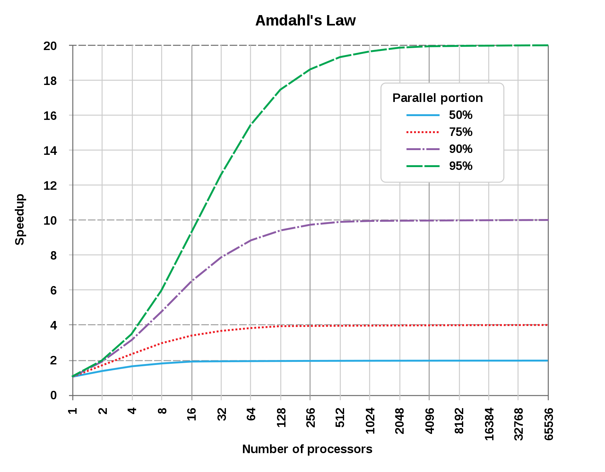
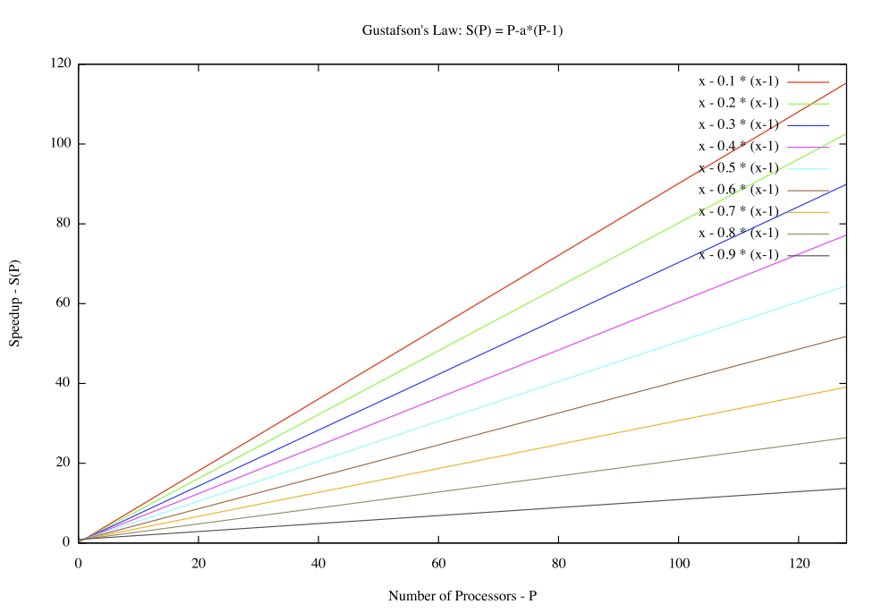
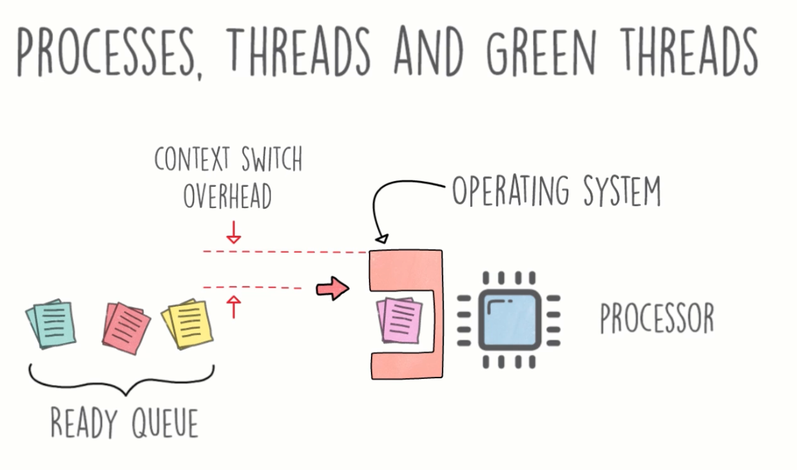
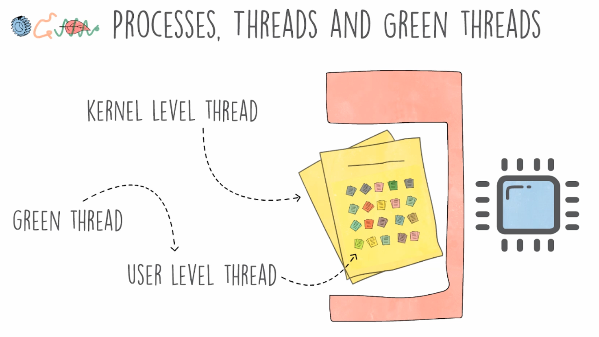

# Mastering Multithreading Programming with Go (Golang)

By James Cutajar. Course [Link](https://www.udemy.com/course/multithreading-in-go-lang/)

All code of this course are in the [boids repository](https://github.com/gpbPiazza/boids)

## Parallel computing
- [Amdahl's law](https://en.wikipedia.org/wiki/Amdahl%27s_law)
  - Amdahl's law is often used in parallel computing to predict the theoretical speedup when using multiple processors.
  - The Amdahl's law defines the optimization of a part of a process is limited by the fraction of time that the improved part is actually used.
  - The limiting the speed-up because of the sequential parts of our software
  
  Definitions:
  - Where `s` is the quantity of time of speedup, how much faster the process will be if we add more processors to the process.
  - The execution time of the whole task before the improvement of the resources of the system is denoted as `T``. 
  - `p` is the fraction of the execution time of the task that would benefit from the improvement of the resources.
  p = TaskB/(TaskA + TaskB)
  
  http://www.johngustafson.net/pubs/pub13/amdahl.htm
- [Gustafson's law](https://en.wikipedia.org/wiki/Gustafson%27s_law)
  - Gustafson's law addresses the shortcomings of Amdahl's law, which is based on the assumption of a fixed problem size, that is of an execution workload that does not change with respect to the improvement of the resources. Gustafson's law instead proposes that programmers tend to increase the size of problems to fully exploit the computing power that becomes available as the resources improve.
  
  - Don't matter the sequential parts of our task if we increase the number of tasks/problems per processor because the relation is always linear. As long, you have an infinite problem size, and you increase the number of processors it doesn't really matter how much of your software is linear, how many sequential parts he has. But your speedup still depends on many parts of your taks is linear or parallel. More parts can be parallel, more speedup.
## Processes, Threads and Green threads

### Processes
  [A bout process](https://en.wikipedia.org/wiki/Process_(computing))
  - Processes is a single piece of software running, independently, isolated, not sharing memory. For examples, you can have two instances of notePad++ and one doesn't affect the other, if one crashes the other keep running. Processes are heavy because when you have two or more process running in parallel you have tow or more unique memory spaces allocated to each process and this operation is expansive.
### Threads
  [A bout Thread](https://en.wikipedia.org/wiki/Thread_(computing))
  - Threads share the same space of memory. In addition, creating a thread is a lot faster than to create an entire new process, because we are not allocating new memory or more resources.
  - However, a thread don't give you the same isolation that an entire new process can provide.
### Green threads
  ##### Or user level threads
  
  [A bout context switch](https://en.wikipedia.org/wiki/Context_switch)
  When an operating system changes a process to another, he has a CPU cycles wasted because of the context switch overhead.

  In resume a context switch is the process of storing the state of a process or thread, so that it can be restored and resume execution at a later point, and then restoring a different, previously saved, state. This allows multiple processes to share a single central processing unit (CPU), In a traditional CPU, each process - a program in execution - utilizes the various CPU registers to store data and hold the current state of the running process. However, in a multitasking operating system, the operating system switches between processes or threads to allow the execution of multiple processes simultaneously. For every switch, the operating system must save the state of the currently running process, followed by loading the next process state, which will run on the CPU. This sequence of operations that stores the state of the running process and the loading of the following running process is called a context switch.

  The process of context switching can have a negative impact on system performance.
  Context switches are usually computationally intensive, and much of the design of operating systems is to optimize the use of context switches. Switching from one process to another requires a certain amount of time for doing the administration – saving and loading registers and memory maps, updating various tables and lists, etc.

  And reduce all this cost of context switch overhead is what the Green threads is trying to solve.
  
## Memory sharing
- Inter process communication (IPC) -> more read https://www.geeksforgeeks.org/inter-process-communication-ipc/
  - Message passing:
  - Shared memory: easy and low cost, but can be hard to manage