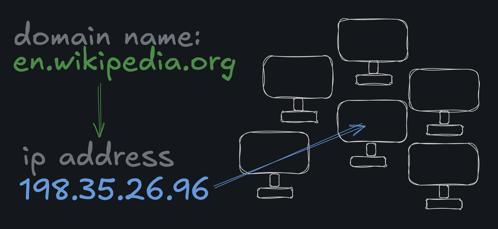

# Notes

[RFC → Official Internet Protocol Standards](https://www.rfc-editor.org/standards)

Keep reading →
https://developer.mozilla.org/en-US/docs/Web/HTTP/Overview
https://developer.mozilla.org/en-US/docs/Learn_web_development/Howto/Web_mechanics/What_is_a_URL
https://en.wikipedia.org/wiki/URL

## Protocol
- A communication protocol is a conjunction of rules that allows two or more entities of a communication system to transmit information. The protocol defines the rules, syntax, semantics, and synchronization of communication and possible error recovery methods. Protocols may be implemented by hardware, software or a combination of both.
- Is like to humans speaking each other, if both speak in Brazilian Portuguese the communication protocol is Brazilian Portuguese.

## Hypertext Transfer Protocol (HTTP)

#### Request and Response
- HTTP is a Request and Response based system, where the client sends a message is called request and whenever the server sends a message to the client is called response.

#### Uniform Resources Locators (URL)

- URLs are address of a unique resource on the internet. Each URL points to a resource(server) that represents a server on some computer somewhere on internet.
- A URL is a type of URI (Uniform Resource Identifier). URIs identify and URLs locate; however, locators are also identifiers, so every URL is also a URI, but there are URIs which are not URLs.

#### URL format

- A URL are composed of different parts, some required and others optional.

<strong>SCHEME</strong>
- Is required and represents the protocol that will be used by the internet or browser.
- Format: <scheme:> or <protocol_name:>. Consisting of a sequence of characters beginning with a letter and followed by any combination of letters, digits, plus +, period . or hyphen -
- Schemes are case-insentive.
- Example of popular schemes(protocols) http, https, ftp, mailto, file and data. Schemes should be registered with the Internet [Assigned Numbers Authority](https://en.wikipedia.org/wiki/Internet_Assigned_Numbers_Authority) (IANA), 
- Not All Schemes Require a "//"
The "http" in a URL is always followed by `://`. All URLs have the colon, but the // part is only included for schemes that have an authority component. As you can see above, the mailto scheme doesn't use an authority component, so it doesn't need the slashes.

<strong>DOMAIN NAME/USERINFO</strong>
- TODO

<strong>PORT</strong>
- The port in a URL is a virtual point where network connections are made. They are an optional part of URL. 
- Ports are managed by a computer's operating system and are numbered from 0 to 65,535 (Though port 0 is reserved for the system API).
- Whenever you connect to another computer over a network, you're connecting to a specific port on that computer, which is listened to by a program on that computer. A port can only be used by one program at a time, which is why there are so many possible ports.
- The port component of a URL is often not visible when browsing normal sites on the internet, because 99% of the time you're using the default ports for the HTTP and HTTPS schemes: 80 and 443 respectively.
- Whenever you are not using the default port you of the protocol(scheme) you must specify.

<strong>PATH</strong>
- Paths in URLs are essentially just another type of parameter that can be passed to the server when making a request.
- Path component consist of a sequence of path segment separated by a slack `/`.
- A path can be an empty path, a segment may also be empty, resulting in two consecutive slashes `//` in the path component.

<strong>PARAMETERS/QUERY</strong>

- The Query parameters in URLs are essentially just another type of parameter that can be passed to the server when making a request.
- They are an optional component.
- Format: after the end of the path parameter we have a question mark `?` symbol to indicate the start of query parameters, they consist of attribute-value pairs(key and value) separated by a delimiter.

| Query delimiter	 | Example                  |
|------------------|--------------------------| 
| Ampersand `(&)`	 |  key1=value1&key2=value2 |
| Semicolon `(;)`  |	key1=value1;key2=value2 |

- Each web-site and server choose to use query parameters as they want, they can work as filters, as required values and soo on, is up on the system that will response the request that will define the usage of query parameters.

<strong>ANCHOR/FRAGMENT</strong>
- TODO

#### Domain Name System (DNS)

Domain name is human-readable of an IP address.

In computing, web clients find other computers over the internet using Internet Protocol (IP) addresses. Each device connected to the internet has a unique IP address.

DNS is the system that client asks with a domain name and return the IP address, domain names are for humans
IP are for computers.

#### HTTP Headers

- An HTTP header allows clients and servers to pass additional information with each request or response. Headers are just case-insensitive key-value pairs that pass additional metadata about the request or response.
- Headers are useful for several reasons from design to security, but most often headers are used for metadata about the request or response itself. 

#### HTTP methods

- The primary purpose of HTTP methods is to indicate to the server what we want to do with the resource we're trying to interact with. At the end of the day, an HTTP method is just a string, like `GET`, `POST`, `PUT`, or `DELETE`(exist more methods than this), but by convention, backend developers write their server code so that the methods correspond with different "CRUD" actions.

- The "CRUD" actions are: Create, Read, Update, Delete

#### HTTP Status Codes

- The Status Code of an HTTP response tells the client whether or not the server was able to fulfill the request. Status codes are 3-digit numbers that are grouped into categories:

`100-199`: Informational responses. These are very rare.
`200-299`: Successful responses. Hopefully, most responses are 200's!
`300-399`: Redirection messages. These are typically invisible because the browser or HTTP client will automatically do the redirect.
`400-499`: Client errors. You'll see these often, especially when trying to debug a client application
`500-599`: Server errors. You'll see these sometimes, usually only if there is a bug on the server.