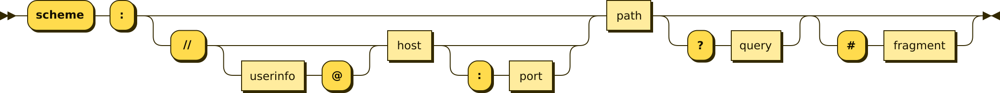

# Notes

[RFC → Official Internet Protocol Standards](https://www.rfc-editor.org/standards)

Keep reading →
https://developer.mozilla.org/en-US/docs/Web/HTTP/Overview
https://developer.mozilla.org/en-US/docs/Learn_web_development/Howto/Web_mechanics/What_is_a_URL
https://en.wikipedia.org/wiki/URL

## Protocol
- A communication protocol is a conjunction of rules that allows two or more entities of a communication
system to transmit information. The protocol defines the rules, syntax, semantics, and synchronization of communication and
possible error recovery methods. Protocols may be implemented by hardware, software or a combination of both.
- Is like to humans speaking each other if both speak in Brazilian Portuguese the communication protocol is Brazilian Portuguese.

## Hypertext Transfer Protocol (HTTP)

### Request and Response
- HTTP is a Request and Response based system, where the client sends a message is called request and
whenever the server sends a message to the client is called response.

### Uniform Resources Locators (URL)

- URLs are address of a unique resource on the internet. Each URL points to a resource(server) that represents a server on some computer somewhere on internet.
- A URL is a type of URI (Uniform Resource Identifier). URIs identify and URLs locate; however, locators are also identifiers, so every URL is also a URI, but there are URIs which are not URLs.

#### URL format

- A URL are composed of different parts, some required and others optional.

<strong>SCHEME</strong>
- Is required and represents the protocol that will be used by the internet or browser.
- Format: <scheme:> or <protocol_name:>. Consisting of a sequence of characters beginning with a letter and followed by any combination of letters, digits, plus +, period . or hyphen -
- Schemes are case-insentive.
- Example of popular schemes(protocols) http, https, ftp, mailto, file and data. Schemes should be registered with the Internet p[Assigned Numbers Authority](https://en.wikipedia.org/wiki/Internet_Assigned_Numbers_Authority) (IANA), 