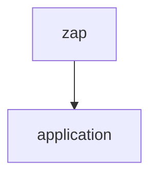

# Network notes

Overall notes from network study.

## OSI Model

Open Systems Interconnection Reference Model, usually abbreviate as ISO or, OSI or, OSI Model. The OSI Model provides a design to allow open systems to communicate. An open system is one that is prepared to communicate with any other open system by using the ***formats***, ***contents*** and ***meaning*** of the messages sent and received.

Those rules we formalize as ***communication protocols***.

#### Protocols
A communication protocol is a conjunction of rules that allows two or more entities of a communication system to transmit information. The protocol defines the ***rules***, ***syntax***, ***semantics***, and ***synchronization of communication*** and possible ***error recovery methods***. Protocols may be implemented by hardware, software or a combination of both.

Is like to humans speaking each other, if both speak in Brazilian Portuguese the communication protocol is Brazilian Portuguese.

---

#### Layers

In the OSI reference model, the communications between systems are split into seven different abstraction layers: Physical, Data Link, Network, Transport, Session, Presentation, and Application.

